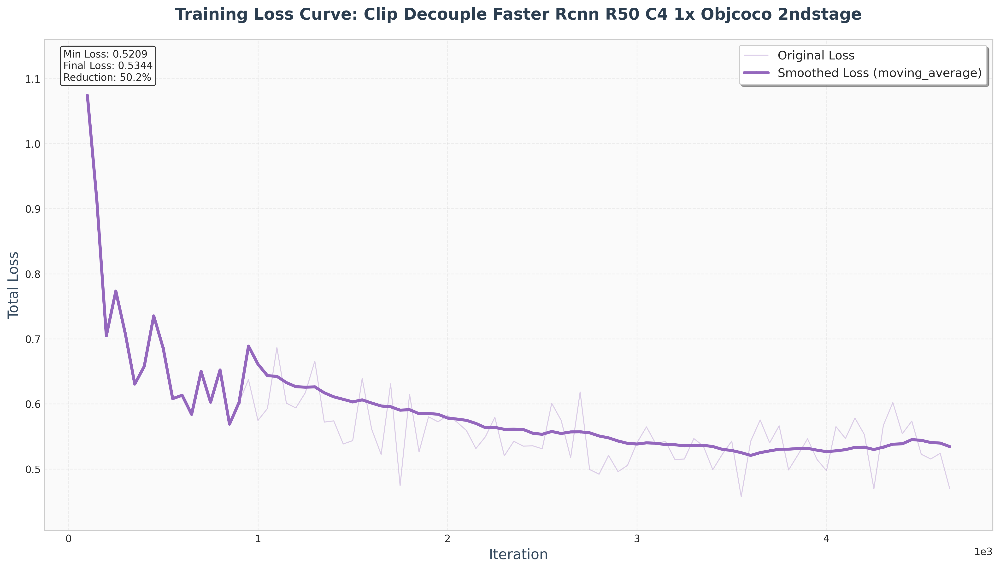

# Training Documentation

This document provides comprehensive information about the training process, GPU Information, dataset details, and training results for the UniDetector project.

## GPU Information
- **GPU Model:** NVIDIA GeForce RTX 4090
- **VRAM:** 24GB
- **CUDA Version:** 11.8
- **Driver Version:** Compatible with CUDA 11.1

## Dataset Information

| Dataset | Images | Annotations | Categories | Sampling Ratio |
|---------|--------|-------------|------------|----------------|
| COCO Train | 5,914 | 43,455 | 80 | 5% |
| COCO Val | 850 | 6,313 | 80 | 17% | Validation |
| Objects365 | 4,157 | 68,229 | 365 | 2% | 
| LVIS Train | 5,008 | 63,762 | 1,203 | 5% | 
| LVIS Val | 792 | 9,311 | 1,203 | 4% | 

## Hyperparameters

#### End-to-End Training Configuration
| Parameter | Value | Description |
|-----------|-------|-------------|
| Learning Rate | 0.005 | Initial learning rate |
| Batch Size | 2 | Samples per GPU |
| Optimizer | SGD | Stochastic Gradient Descent |
| Step Decay | [2, 3] | Learning rate decay epochs |
| Max Epochs | 4 | Total training epochs |
| Pre-trained Weights | RegionCLIP | Load from pre-trained model |

#### Stage 1 Training Configuration (Region Proposal)
| Parameter | Value | Description |
|-----------|-------|-------------|
| Learning Rate | 0.005 | Initial learning rate |
| Batch Size | 4 | Samples per GPU |
| Optimizer | SGD | Stochastic Gradient Descent |
| Max Epochs | 4 | Total training epochs |
| Step Decay | [3, 4] | Learning rate decay epochs |
| Pre-trained Weights | ImageNet | from the official PyTorch repository |

#### Stage 2 Training Configuration (RoI Classification)
| Parameter | Value | Description |
|-----------|-------|-------------|
| Learning Rate | 0.001 | Initial learning rate |
| Batch Size | 4 | Samples per GPU |
| Optimizer | SGD | Stochastic Gradient Descent |
| Max Epochs | 4 | Total training epochs |
| Step Decay | [3, 4] | Learning rate decay epochs |
| Pre-trained Weights | RegionCLIP | Load from pre-trained model |

## Training Results

### Loss Curves Analysis

The training loss curves have been generated for all training runs with the following features:
- **Smoothing Factor:** 0.9 (exponential moving average)
- **First Point Filtering:** Automatically skips the first iteration if loss > 100
- **Dual Visualization:** Original curve (light color) and smoothed curve (dark color)

#### End2end model(obj365 and coco)

#### Decouple model(Stage1)

#### Decouple model(Stage2)

### Performance Comparison Tables

Due to limited computational resources, I only trained on the small dataset mentioned in the dataset information above.

As for the Jittor content, it is still under debugging. You can check the progress in the [Jittor readme](../jittor_unidetector/README.md).

#### 1. Proposal Generation Performance (Train:COCO + Obj365 | Test: LVIS v1.0)
| Framework | Decouple | Proposal Generation | AP | AP_r | AP_c | AP_f |
|-----------|----------|-------------------|----|------|------|------|
| PyTorch | Yes | RPN | 2.0 | 2.6 | 2.3 | 1.9 |
| PyTorch | Yes | CLN | 3.3 | 3.7 | 4.3 | 3.0 |
| Jittor | Yes | CLN | - | - | - | - |

The author's CLN network indeed further improves the retrieval performance and enhances the final results.

#### 2. Overall Test Performance
| Framework | Datasets | Structure | AP | AP_r | AP_c | AP_f |
|-----------|----------|-----------|----|------|------|------|
| Pytorch (Origin) | LVIS v1.0 | ~ | 6.7 | 0.0 | 1.5 | 8.0 |
| PyTorch | COCO | P | 2.2 | 4.2 | 3.1 | 1.7 |
| PyTorch | COCO + O365 | P | 3.3 | 4.2 | 4.2 | 3.0 |
| Jittor | COCO + O365 | P | - | - | - | - |

Similar to the experimental results in the author's paper, there is an improvement in few-shot capability, but a decline in frequently occurring categories.

#### 3. Closed-loop Dataset Test ((Train:COCO train2017 | Test: COCO val2017))
| Framework | AP | AP_S | AP_M | AP_L |
|-----------|----|------|------|------|
| Pytorch (Origin) | 17.9 | 8.6 | 21.9 | 25.9 |
| PyTorch | 10.3 | 1.6 | 8.6 | 21.4 |
| Jittor | - | - | - | - |

The results are somewhat inconsistent with the experiments in the paper (despite trying various hyperparameter tuning experiments). The performance is still inferior in terms of closed-loop ability compared to directly training on FasterRCNN. It is likely that the amount of training data is insufficient, and the author's model has a higher upper limit.

### Others
- Detailed log information and the model are stored in the log/ folder.
- All loss curves are saved in the plot_results folder.
- Detailed models and parameter settings are stored in the configs folder.
